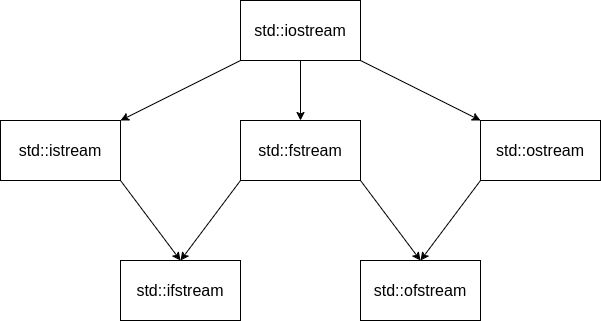

# Седмица 07 - Потоци и файлове

## Потоци
Много често ни се налага да имаме няколко програми, които си взаимодействат - част от тях генерират някакви данни, а друга част от тях използват генерираните данни, за да направят някакви изчисления (те също може да са генератори за други програми). В такива случаи искаме, когато програмите-генератори приключат своята работа, резултата от нея да се запази, за да може някоя друга програма да го използва. Потоците са механизъм, който ни позволява точно това. За потоците може да си мислим като за буфери, в които слагаме и взимаме някакви данни последователно. Пример за потоци, които използваме постоянно са стандартния вход и стандартния изход - потребителя записва данни на стандартния вход, посредством клавиатурата, а програмата чете данни от него чрез `std::cin`. При стандартния изход е наобратно - програмата записва данни в него чрез `std::cout`, а потребителя ги "консумира" като терминала ги разпечатва за него. 

## Файловете като потоци и сравнение с масиви
Файлът е блок от данни, записан на някакъв траен носител. В някакъв смисъл блокът от данни прилича доста на масив - данните в него са разположени последователно и могат да бъдат индексирани. Данните във файла, за разлика от тези в масива обаче, са персистентни - те не се изтриват след приключване на програмата или изключване на машината, на която са записани. Също така данните във файловете могат да са доста големи и достъпа до тях е много бавен, понеже се съхраняват на диска.

Свойствата на файловете, разгледани по-горе, ни позволяват да разглеждаме файловете като потоци. В тях можем да записваме и да четем данни последователно. Също така файлът има няколко свойства повече спрямо потока - саморазширява се при записването на данни в него и могат да се достъпват елементи на произволни позиции в него.

## Йерархия на потоците в C++
В C++ има много начини за създаване на потоци, като някои от тях са просто по-конкретни версии на някои други. На долната графика са представени всички важни за нас потоци за работа с файлове. Стрелките между отделните потоци показват кой поток кой наследява, т.е. с кой поток има общи характеристики, но е по-конкретен. Също така имаме взаимно заменяемост - ако един поток `X` наследява поток `Y`, то навсякъде в програмата, където очакваме поток `Y`, може да използваме поток `X`.



## Работа с текстови файлове
При текстовите файлове имаме форматиран вход и изход, т.е. можем да записваме данните в някакъв формат, който може да се прочете от човек - цифри, букви, специални знаци и др. Това означава, че можем да интерпретираме данните във файла като текст. Но стандартния вход и стандартния изход имат същите свойства - това означава, че работата с текстови файлове ще е почти същата като тази със стандартния вход и изход. Но преди да започнем да записваме или четем данни от файл, трябва да го отворим за четене или писани или и двете. Да разгледаме различните начини за отваряне на файл:
```c++
std::fstream file("file.txt");
std::fstream file("file.txt", std::ios::in);
std::fstream file("file.txt", std::ios::out);
std::ofstream file("file.txt");
std::ifstream file("file.txt");

std::fstream file;
file.open("file.txt");
```

- първият отваря файл едновременно за четене и писане;
- вторият отваря файл само за четене;
- третият отваря файл само за писане;
- четвъртият е по-кратък запис за втория;
- петият е по-кратък запис за третия;
- шестият е аналогичен на първия, но при него създаването на потока и отварянето на файла е на две стъпки.

Аргумента, който подаваме при отваряне на файл е пътят до този файл, като той може да бъде абсолютен или релативен. Нещо, което не трябва да забравяме при работа с файлове е да ги затворим след като сме спрели да ги ползваме. Това става като извикаме функцията `close()` на файловия поток, който сме създали. Ако не затворим файл може да настъпят много проблеми - от невъзможност на други програми да отварят файла до борба за ресурсите на файла.

Сега вече като сме отворили файла, можем да работим с него по абсолютно същия начин като със `std::cin` и `std::cout` - ако искаме да запишем данни във файла използваме операторът `<<`, а ако искаме да прочетем - `>>`. Пример за записване и четене на числа във и от файл:
```c++
std::fstream file("numbers.txt");

int n;
file >> n;
n *= 10;
file << n;

file.close();
```

В този пример прочитаме едно цяло число от файла, умножаваме го по 10 и го записваме обратно във файла. Записването става на позицията след тази, от която сме прочели първоначално числото, като ако е имало някакви данни там, те се презаписват.

## Указатели във файловете
По-горе стана въпрос, че може да достъпваме елементи на произволни позиции във файл. Това е възможно понеже вътрешно във всеки файл има два указателя - единият следи до коя позиция сме стигнали с четенето от него и до коя позиция - с писането. Ако файлът е отворен и за писане, и за четене, то двата указателя стоят на една и съща позиция. Имаме възможността и да ги отместваме ръчно - именно така можем да достъпваме елементи на произволни позиции и един вид да индексираме елементите. За тази цел имаме следните функции към файловите потоци:
- `tellg` - връща позицията на указателя за четене;
- `tellp` - връща позицията на указателя за писане;
- `seekg` - мести указателя за четене на подадената позици;
- `seekp` - мести указателя за писане на подадената позиция;

## Двоични файлове срещу текстови файлове
При текстовите файлове имаме форматиран вход и изход, т.е. данните се записват във формат, удобен за четене от хора (UTF-8 например), но в неудобен формат за четене от програмите. В този случай ние не можем да достъпваме пряко обектите, записани във файла, понеже нямаме гаранция, че всички обекти ще имат равен размер. За сметка на това пък, последователния достъп е доста лесен, особено понеже имаме операторите за форматиран вход и изход - >> и <<. За да гарантираме, че обекти от един и същи тип, ще заемат един и същи размер при запис във файла, трябва този запис да бъде неформатиран - т.е. трябва данните да бъдат записани директно като байтове, а не като кодирани символи. Файлове, които съхраняват "сурови" последователности от байтове се наричат двоични файлове. Освен, че двоичните файлове предразполагат пряк достъп до данните в тях, четенето и писането от тях е доста по-ефективно спрямо тези при текстовите файлове.

## Запис и четене от двоични файлове
За да пишем и четем от двоичен файл на първо място, трябва да отворим файла в режим за работа с двоични файлове - това става като при отварянето на файла вдигнем флага `std::ios::binary`. За работа с отворения вече двоичен файл, не можем да използваме операторите >> и <<, понеже както стана дума по-горе, те служат само за форматиран вход и изход. За работа с неформатиран вход и изход, се използват функциите `write` и `read`. Те приемат указател към масив от тип `char` и брой знаци, които да бъдат записани/прочетени (`write` и `read` не спират при срещане на терминираща нула!). Но както знаем, размерът на `char` е точно 1 байт - т.е. ако успеем да "транслираме" нашите обекти до последователност от тип `char`, то ние ще успеем да ги запишем в двоичен формат. В C++ това се постига чрез оператора `reinterpret_cast`. Чрез него ние можем да преобразуваме указател от всякакъв тип до указател от всякакъв друг тип. Това става, като се запази последователността от битове на обекта, сочен от оригиналния указател, и само се промени тяхната интерпретация спрямо типа на новия указател. Това е най-опасният вид преобразуване на типове и трябва да го използваме, само когато сме абсолютно сигурни, че знаем какво правим. Нека разгледаме пример за писане и четене от двоичен файл:

```c++
struct Triangle {
  double a, b, c;
};

int main() {
  Triangle triangle = { .a = 3, .b = 4, .c = 5};
  std::fstream file("triangle.bin", std::ios::out | std::ios::binary);

  file.write(reinterpret_cast<const char*>(&triangle), sizeof(Triangle));
  file.close();

  file.open("triangle.bin", std::ios::in | std::ios::binary);

  Triangle input;
  file.read(reinterpret_cast<char*>(&input), sizeof(Triangle));
  file.close();

  std::cout << input.a << ' ' << input.b << ' ' << input.c << '\n'; // -> 3 4 5
  return 0;
}
```

## Пряк достъп в двоични файлове
След като вече видяхме как можем да пишем и четем от двоични файлове, можем най-накрая да видим как да достъпваме пряко данни, записани в двоичен формат. Ако знаем, че файлът ни се състои от данни от еднороден тип, то можем да се отместваме на равни интервали с размер равен на един обект от този тип, за да си гарантираме, че указателят ще бъде винаги в началото на обект от този тип. Ето пример, при който искаме да вземем петия триъгълник от файл, съдържащ само триъгълници в двоичен формат:

```c++
std::fstream file("triangles.bin", std::ios::in | std::ios::binary);

Triangle input;
file.seekg(4 * sizeof(Triangle));
file.read(reinterpret_cast<char*>(&input), sizeof(Triangle));
file.close();
```

## Особености при сериализация на динамично заделени данни
Едно от най-важните неща които засегнахме при работата с двоични файлове, е че искаме сериализираните обекти да имат еднакъв размер, за да можем лесно да извършваме пряк достъп до тях. Когато обаче имаме динамично заделени данни в обектите се срещаме с нов проблем - в обекта пазим само указател към тези данни, а размерът на самите данни може да варира. Ако сериализираме само указателя, ще бъде грешно, понеже адресът сочен от него е валиден само за текущата програма - след нейното приключване паметта, сочена от него, ще бъде освободена и при последвал достъп ще получим грешка при сегментацията. Решението в случая е да запазим първо размерът на динамично заделените данни и след това да сериализираме и тях. Така, при следващо четене от файла, ще знаем колко точно байта заема нашия обект, но тогава се сблъскваме със същия проблем, който имахме и при текстовите файлове - данните имат различен размер и прекият достъп вече не е толкова лесен. Има няколко начина, по които можем да се справим с този проблем:

- да пазим в отделен файл таблица с началните позиции на всеки обект във файла;
- да пазим динамично заделените данни в отделна секция от файла и на тяхно място в обектите да пазим указател към позициите на тези данни;
- към всеки обект да запишем и заглавна част (header), която носи допълнителна информация за обекта, като например размера на данните в него и др.

## Задача 01 - Книга
Да се реализира клас `Book`, който представлява книга, която има име (до 100 символа), автор (до 50 символа) и уникален номер (положително цяло число). Класът да реализира следните методи:
- void serialize(std::ostream& os) const - записва книгата в текстов поток;
- void deserialize(std::istream& is) - чете книга от текстов поток;
- void serialize_binary(std::ostream& os) const - записва книгата в двоичен поток;
- void deserialize_binary(std::istream& is) - чете книга от двоичен поток;
- void serialize_at(std::ostream &os, std::size_t pos) const - записва книга на дадена позиция в двоичен поток;
- void deserialize_at(std::istream &is, std::size_t pos) - чете книга на дадена позиция в двоичен поток.

## Задача 02 - Библиотека
Да се реализира клас `Library`, който представлява библиотека, която има име с произволна дължина и списък от книги. Класът да реализира следните методи:
- void add(const Book& book) - добавя книга към библиотеката;
- std::size_t get_list_size() const - връща размера на списъка с книгите;
- const std::string& get_name() const - връща името на библиотеката;
- void serialize(std::ostream& os) const - записва библиотеката в текстов поток;
- void deserialize(std::istream& is) - чете обект от текстов поток.

### Бонус*:
Добавете методи за сериализация в двоичен файл. Помислете как да сериализирате динамичните данни коректно.